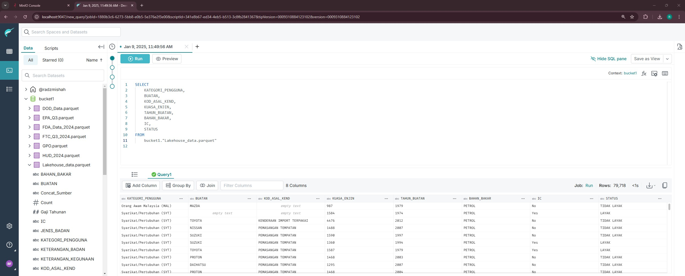

# Modernizing Data Lakehouse

## Objective
The objective of this project is to modernize data lakehouse infrastructure using tools such as Dremio, MinIO, and Alteryx, while improving and accelerating the eligibility process through machine learning methods.

## Data Engineering

In this project, Dremio were used as the query engine, MinIO as Object Storage, and Alteryx as verfication processs and machine learning. 

### Legacy Architecture

- Microsoft SQL Server (MSSQL) serves as the primary data source for this project, while Microsoft Excel is currently used as an ETL tool despite its scalability limitations. The processed data is then stored in a data warehouse, where it undergoes validation by the Data Verification Team before being analyzed and presented to managers to support data-driven decision-making.

### Modern Architecture

- Data is ingested from multiple sources and transformed through an ETL pipeline before being stored in a scalable object storage system. Dremio then acts as the query engine, enabling efficient data access, analysis, and querying across the stored datasets.

- Some of the querying process in Dremio

## Machine Learning

- This is the EDA processs that already been done in Alteryx. The dataset is first loaded and filtered by selecting only the required columns. Rows containing null values are removed to ensure data quality, followed by renaming columns and adjusting data types for consistency. The data is then grouped based on relevant criteria before being exported in CSV format for further analysis or storage.

Alteryx plays an important role in the verification process by improving speed, reducing manual errors, and enabling automation for future financial incentive cycles. After building the workflow in Alteryx Designer, it can be deployed to Alteryx Server, where clients can schedule execution times and automatically save outputs to a specified folder. This automation improves efficiency, but it has limitations. The workflow can only be reused if the verification logic remains unchanged. Any updates to business rules or requirements require the workflow to be reconfigured before the next run.

This project also includes training supervised machine learning models to support eligibility verification. Three models were tested: Logistic Regression, Random Forest, and XGBoost.
After evaluation, Random Forest was selected as the best model because it provides a strong balance between performance and efficiency. Logistic Regression had weaker performance in predicting positive cases, while XGBoost achieved similar results to Random Forest but required higher computational resources and longer training time.

